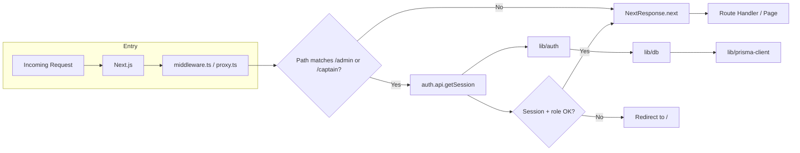
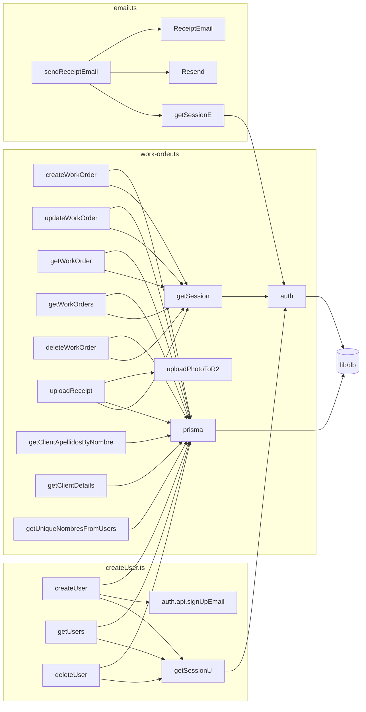
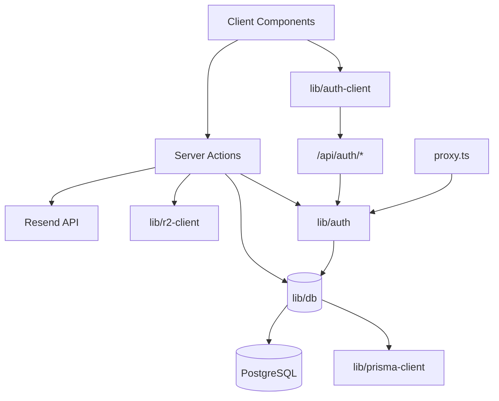

# Bayside PV — Application Flow Chart

This document describes the flow from entry point through middleware, routes, components, and server actions, with a brief description of each item.

---

## 1. Application entry and request flow



| Item | Description |
|------|-------------|
| **Next.js** | App router; receives every request and runs middleware first. |
| **proxy.ts** | Auth middleware. Matches `/admin/*` and `/captain/*`; runs before page/API. |
| **auth.api.getSession** | better-auth API: reads cookies/headers and returns current session (and user). |
| **lib/auth** | better-auth config: Prisma adapter, email/password, session/cookie, trusted origins. |
| **lib/db** | Prisma singleton: `Pool` + `PrismaPg` adapter → single `PrismaClient` used by auth and actions. |
| **lib/prisma-client** | Generated Prisma client (custom output); used by `lib/db`. |

---

## 2. Route and layout hierarchy

```mermaid
flowchart TD
    Root[app/layout.tsx - RootLayout]
    Root --> Toaster[Toaster]
    Root --> Children[children]
    
    Children --> Landing[app/page.tsx - LandingPage]
    Children --> AuthAPI[app/api/auth/.../route.ts]
    Children --> Admin[app/admin/*]
    Children --> Captain[app/captain/*]
    
    Landing --> LandingContent[LandingPageContent]
    AuthAPI --> toNextJsHandler[auth - better-auth handler]
    
    Admin --> AdminDashboard[admin/page.tsx]
    Admin --> AdminCreate[admin/create/page.tsx]
    Admin --> AdminList[admin/list/page.tsx]
    Admin --> AdminOrder[admin/order/[id]/page.tsx]
    Admin --> AdminUsers[admin/users/page.tsx]
    Admin --> AdminAddUser[admin/add-user/page.tsx]
    Admin --> AdminSearch[admin/search/page.tsx]
    Admin --> AdminPrint[admin/print/page.tsx]
    
    Captain --> CaptainLanding[captain/page.tsx]
    Captain --> CaptainOrder[captain/order/[id]/page.tsx]
```

| Item | Description |
|------|-------------|
| **app/layout.tsx** | Root layout: fonts, globals, wraps all pages; renders `children` and `<Toaster />`. |
| **app/page.tsx** | Landing: sign-in form; uses `authClient.useSession()` and `authClient.signIn.email`; redirects by role to `/admin` or `/captain`. |
| **app/api/auth/[...all]/route.ts** | Catch-all auth API: delegates GET/POST to better-auth (`toNextJsHandler(auth)`). |
| **app/admin/page.tsx** | Admin dashboard: server component; gets session via `auth.api.getSession`; renders nav cards (filtered for representante). |
| **app/admin/create/page.tsx** | Create order page: client; renders `AdminHeader` + `WorkOrderForm` with `mode="admin-create"`. |
| **app/admin/list/page.tsx** | Order list: client; calls `getWorkOrders`, renders table with edit/delete; links to `admin/order/[id]`. |
| **app/admin/order/[id]/page.tsx** | Edit order (admin): client; calls `deleteWorkOrder`, renders `AdminHeader` + `WorkOrderForm` with `mode="admin-edit"`. |
| **app/admin/users/page.tsx** | User list page: client; wraps `AdminHeader` + `AdminUserList`. |
| **app/admin/add-user/page.tsx** | Add user page: client; form calls `createUser`; uses `AdminHeader`. |
| **app/admin/search/page.tsx** | Search by order #: client; calls `getWorkOrder`, then redirects to `admin/order/[id]`. |
| **app/admin/print/page.tsx** | Nota de Pago: client; form calls `sendReceiptEmail`; uses `AdminHeader`. |
| **app/captain/page.tsx** | Captain home: client; order ID input → navigate to `captain/order/[id]`; includes `SignOutButton`. |
| **app/captain/order/[id]/page.tsx** | Edit order (captain): client; renders `WorkOrderForm` with `mode="captain-edit"` and `orderId`. |

---

## 3. Component → component and → server actions

```mermaid
flowchart TD
    subgraph Pages
        P1[admin/create] --> WOF[WorkOrderForm]
        P2[admin/order/id] --> WOF
        P3[captain/order/id] --> WOF
        P4[admin/list] --> AHL[AdminHeader]
        P5[admin/users] --> AUL[AdminUserList]
        P6[admin/add-user] --> createUser[createUser]
        P7[admin/print] --> sendReceiptEmail[sendReceiptEmail]
        P8[admin/search] --> getWorkOrder[getWorkOrder]
    end
    
    subgraph Shared Components
        AHL --> SOB[SignOutButton]
        AdminDashboard --> AHL
        AdminCreate --> AHL
        AdminOrder --> AHL
        AdminUsers --> AHL
        AdminAddUser --> AHL
        AdminSearch --> AHL
        AdminPrint --> AHL
    end
    
    WOF --> CaptainSelect
    WOF --> createWO[createWorkOrder]
    WOF --> updateWO[updateWorkOrder]
    WOF --> getWO[getWorkOrder]
    WOF --> uploadReceipt[uploadReceipt]
    WOF --> getClientApellidos[getClientApellidosByNombre]
    WOF --> getNombres[getUniqueNombresFromUsers]
    WOF --> getDetails[getClientDetails]
    
    CaptainSelect --> API[/api/users]
    API --> auth
    auth --> db[(lib/db)]
    
    AUL --> getUsers[getUsers]
    AUL --> deleteUser[deleteUser]
    
    createWO --> db
    updateWO --> db
    getWO --> db
    uploadReceipt --> db
    uploadReceipt --> R2[lib/r2-client]
    getUsers --> db
    deleteUser --> db
    createUser --> auth
    createUser --> db
    sendReceiptEmail --> auth
    sendReceiptEmail --> Resend[Resend + ReceiptEmail]
```

| Component / API | Description |
|-----------------|-------------|
| **AdminHeader** | Shared admin header: title, optional back link, `SignOutButton`; optional `rightActions`. |
| **SignOutButton** | Calls `authClient.signOut`; used in header and captain landing. |
| **WorkOrderForm** | Main form: modes `admin-create`, `admin-edit`, `captain-edit`. Uses react-hook-form, Zod (admin/captain schemas), `CaptainSelect`; calls work-order actions and R2 upload. |
| **CaptainSelect** | Fetches captains from `GET /api/users?role=captain`; passes selected captain id (or "unassigned") to form. |
| **AdminUserList** | Fetches list via `getUsers`, deletes via `deleteUser`; table with add-user link and delete actions. |

---

## 4. Server actions (function → function)



| Action / function | Description |
|-------------------|-------------|
| **getSession** (work-order) | Gets session via `auth.api.getSession(headers)`; throws if unauthenticated; used for RBAC in all work-order actions. |
| **createWorkOrder** | Validates with admin/captain schema, checks role; creates `WorkOrder` via prisma; revalidates `/admin/list`. |
| **updateWorkOrder** | Validates, checks session and order access (captain = own orders); updates `WorkOrder`; revalidates list and order paths. |
| **getWorkOrder** | Validates id; loads order with receipts; enforces captain = assigned order only. |
| **getWorkOrders** | Returns orders (captain: only where `captainId = session.user.id`); used by admin list. |
| **deleteWorkOrder** | Admin/representante only; deletes order (cascade receipts); revalidates paths. |
| **uploadReceipt** | Session + order access check; validates file size; `uploadPhotoToR2` then `prisma.receipt.create`; revalidates order paths. |
| **getClientApellidosByNombre** | Queries `User` by `nombre` (startsWith), returns distinct `apellido`; used for form autocomplete. |
| **getClientDetails** | Finds `User` by `nombre` + `apellido`; returns email/cell; used to auto-fill client contact. |
| **getUniqueNombresFromUsers** | Distinct `nombre` from `User`; populates name dropdown in form. |
| **createUser** | Admin only; checks duplicate nombre+apellido; `auth.api.signUpEmail`; verifies user in DB; revalidates `/admin`. |
| **getUsers** | Admin only; returns all users; used by AdminUserList. |
| **deleteUser** | Admin only; deletes user by id; revalidates `/admin`. |
| **sendReceiptEmail** | Admin only; builds ReceiptEmail; sends via Resend with optional logo attachment. |

---

## 5. Data and auth flow summary



| Layer | Description |
|-------|-------------|
| **lib/auth-client** | Frontend auth: `createAuthClient` (better-auth/react); sign-in, sign-out, `useSession`. |
| **lib/auth** | Server auth: better-auth with Prisma adapter, email/password, session/cookie, trusted origins. |
| **lib/db** | Single Prisma instance with pg Pool + PrismaPg adapter; used by auth and all server code. |
| **lib/r2-client** | Uploads receipt images to Cloudflare R2; used by `uploadReceipt`. |
| **lib/schemas** | Zod schemas: `getAdminSchema`, `getCaptainSchema`; used by WorkOrderForm and work-order actions. |

---

## 6. Quick reference: page → main components and actions

| Route | Main components | Main actions / API |
|-------|-----------------|---------------------|
| `/` | LandingPageContent, Card, Input, Button | authClient.signIn.email, authClient.useSession |
| `/admin` | AdminHeader, Link (cards) | auth.api.getSession |
| `/admin/create` | AdminHeader, WorkOrderForm (admin-create) | createWorkOrder |
| `/admin/list` | AdminHeader, Table, Button | getWorkOrders, deleteWorkOrder |
| `/admin/order/[id]` | AdminHeader, WorkOrderForm (admin-edit) | getWorkOrder, updateWorkOrder, deleteWorkOrder |
| `/admin/users` | AdminHeader, AdminUserList | getUsers, deleteUser |
| `/admin/add-user` | AdminHeader, form inputs | createUser |
| `/admin/search` | AdminHeader, form | getWorkOrder |
| `/admin/print` | AdminHeader, form | sendReceiptEmail |
| `/captain` | SignOutButton, form | — |
| `/captain/order/[id]` | WorkOrderForm (captain-edit) | getWorkOrder, updateWorkOrder, uploadReceipt |
| `/api/auth/*` | — | better-auth (auth) |
| `/api/users` | — | prisma.user.findMany, auth.api.getSession |

This flowchart and the tables above describe the flow from function to function and component to component for the Bayside PV work order application.
