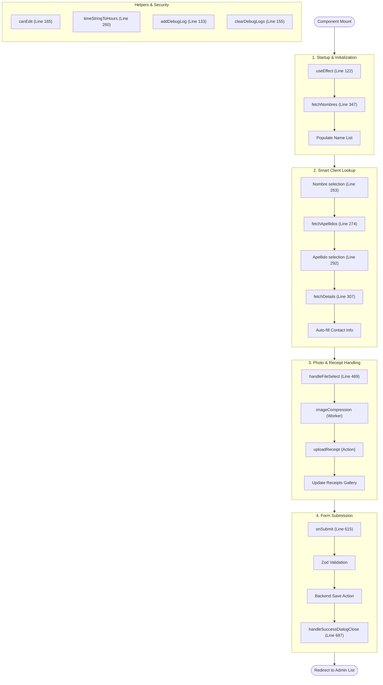

# WorkOrderForm.tsx Function Flow (with Line Numbers)

This diagram outlines the sequential flow of the component with exact line numbers for each function.

## Function Summary with Line Numbers

| Function | Line # | Primary Role |
| :--- | :--- | :--- |
| **`WorkOrderForm`** | 76 | Main component entry point and state initialization. |
| **`addDebugLog`** | 133 | Persistent logging for mobile-specific troubleshooting. |
| **`clearDebugLogs`** | 155 | Clears the persistent debug log from storage. |
| **`canEdit`** | 165 | Permission layer separating Admin and Captain views. |
| **`timeStringToHours`** | 260 | Converts HH:MM strings into decimal hours for calculations. |
| **`fetchApellidos`** | 274 | Dynamic fetching of last names based on first name selection. |
| **`fetchDetails`** | 307 | Auto-retrieval of client email/cell to speed up entry. |
| **`fetchNombres`** | 347 | Initial population of client first names from DB on mount. |
| **`handleFileSelect`** | 469 | Heavy-duty image compression and secure cloud upload. |
| **`onSubmit`** | 615 | Terminal action that validates and saves all data. |
| **`handleSuccessDialogClose`** | 697 | Cleanup and redirection after a successful save. |

flowchart TD
    Start([Component Mount]) --> Setup
    
    subgraph Setup ["1. Startup & Initialization"]
        direction TB
        S1["useEffect (Line 122)"] --> S2["fetchNombres (Line 347)"]
        S2 --> S3[Populate Name List]
    end
    
    Setup --> ClientData
    
    subgraph ClientData ["2. Smart Client Lookup"]
        direction TB
        C1["Nombre selection (Line 263)"] --> C2["fetchApellidos (Line 274)"]
        C2 --> C3["Apellido selection (Line 292)"]
        C3 --> C4["fetchDetails (Line 307)"]
        C4 --> C5[Auto-fill Contact Info]
    end
    
    ClientData --> PhotoMgmt
    
    subgraph PhotoMgmt ["3. Photo & Receipt Handling"]
        direction TB
        P1["handleFileSelect (Line 469)"] --> P2["imageCompression (Worker)"]
        P2 --> P3["uploadReceipt (Action)"]
        P3 --> P4[Update Receipts Gallery]
    end
    
    PhotoMgmt --> Submission
    
    subgraph Submission ["4. Form Submission"]
        direction TB
        D1["onSubmit (Line 615)"] --> D2[Zod Validation]
        D2 --> D3[Backend Save Action]
        D3 --> D4["handleSuccessDialogClose (Line 697)"]
    end
    
    Submission --> Finish([Redirect to Admin List])

    subgraph Utils ["Helpers & Security"]
        direction TB
        H1["canEdit (Line 165)"]
        H2["timeStringToHours (Line 260)"]
        H3["addDebugLog (Line 133)"]
        H4["clearDebugLogs (Line 155)"]
    end

cp /Users/jim/.gemini/antigravity/brain/63bca317-1b29-4b48-aa5c-4903ef6b712d/work_order_form_flow.md /Users/jim/Code/workOrder/WORK_ORDER_FORM_FLOW.md